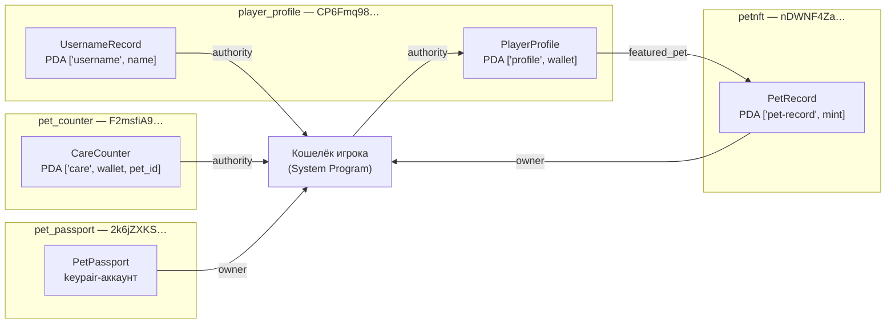

# Неделя 6. Accounts, PDAs и архитектура программ: on-chain профиль игрока

**Задание (силлабус):** создать децентрализованный on-chain профиль с
использованием PDA. Результат — PO2.

**Что сделано:**

- `programs/player_profile` — Anchor-программа профиля игрока. Профиль лежит в
  PDA, а не в базе PetNFT;
- уникальные ники на уровне блокчейна: второй PDA на каждый ник;
- в профиле можно закрепить «любимого питомца», но только настоящий
  `PetRecord` программы `petnft`, принадлежащий этому кошельку. Программа
  проверяет аккаунт **другой программы**;
- тесты (10 новых, всего 17), клиент `clients/player-profile.ts`, деплой в
  **Devnet**, блок **On-chain profile** на странице Profile во фронтенде.

## PDA за один экран

**Program Derived Address** — адрес, который не является публичным ключом:
он вычисляется как `sha256(seeds ‖ bump ‖ program_id ‖ "ProgramDerivedAddress")`
и подбирается так, чтобы точка **не лежала на кривой ed25519**. Значит:

- у PDA нет приватного ключа: подписать за него может только программа,
  из чьего `program_id` он выведен (`invoke_signed`). Ровно так в неделе 2
  Token Metadata делал `mintTo` от имени PDA master edition;
- адрес **детерминирован**: зная seeds и программу, любой клиент его
  вычислит, хранить адреса нигде не нужно;
- `bump` (255, 254, …) — первое значение, при котором точка ушла с кривой
  (canonical bump). Мы сохраняем его в аккаунте (`profile.bump`) и потом
  передаём в `seeds + bump`. Так программа не перебирает bump заново и
  принимает только канонический адрес.

Seeds — это и есть «схема базы данных» on-chain:

| Seeds | Отношение | Пример |
|---|---|---|
| `["profile", wallet]` | один профиль на кошелёк (1:1) | `PlayerProfile` |
| `["username", username]` | один владелец на ник — **уникальный индекс** | `UsernameRecord` |
| `["care", wallet, pet_id]` | много счётчиков у кошелька (1:N) | `CareCounter`, неделя 5 |
| `["pet-record", mint]` | одна запись на NFT | `PetRecord` (`petnft`) |

## Архитектура аккаунтов PetNFT



| Аккаунт | Программа-владелец | Как адресуется | Размер | Rent (devnet) | Кто может менять |
|---|---|---|---|---|---|
| `PlayerProfile` | `player_profile` | PDA `["profile", wallet]` | 278 байт | 0.00206 SOL | только `authority` |
| `UsernameRecord` | `player_profile` | PDA `["username", name]` | 41 байт | 0.00086 SOL | создаётся/закрывается вместе с ником |
| `PetRecord` | `petnft` | PDA `["pet-record", mint]` | 121 байт | 0.00126 SOL | только `owner` |
| `CareCounter` | `pet_counter` | PDA `["care", wallet, pet_id]` | 93 байта | 0.00112 SOL | только `authority` |
| `PetPassport` | `pet_passport` | случайный keypair | 125 байт | 0.00129 SOL | только `owner` |

Писать в данные аккаунта может **только программа-владелец**. Поэтому
`player_profile` не может изменить `PetRecord`, но может его **прочитать** и
проверить. Это и есть граница между программами.

**Keypair-аккаунт против PDA.** На неделе 4 паспорт создавался на случайном
keypair: клиент обязан хранить его адрес и подписывать создание вторым
ключом. PDA снимают обе проблемы: адрес выводится из смысла (кошелёк, ник,
mint), а «подписывает» его программа.

## Программа `player_profile`

| Инструкция | Аккаунты | Что делает |
|---|---|---|
| `create_profile(username, bio)` | authority, profile `init`, username_record `init`, system_program | создаёт оба PDA; второй `init` падает, если ник занят |
| `update_bio(bio)` | authority, profile | bio ≤ 160 байт |
| `change_username(new)` | authority, profile, old_username_record `close`, new_username_record `init` | атомарно освобождает старый ник (rent возвращается) и занимает новый |
| `set_featured_pet()` | authority, profile, pet_record (**аккаунт `petnft`**) | закрепляет своего питомца |
| `clear_featured_pet()` | authority, profile | |
| `close_profile()` | authority, profile `close`, username_record `close` | удаляет профиль, ник освобождается для других |

Ник: `[a-z0-9_]{3,20}`. Только нижний регистр, чтобы `Blaze` и `blaze` не
стали двумя разными пользователями, и ник всегда годится как seed (≤ 32 байт).

### Проверка аккаунта чужой программы

```rust
#[account(
    seeds = [b"pet-record", pet_record.mint.as_ref()],
    bump = pet_record.bump,
    seeds::program = petnft::ID,
    constraint = pet_record.owner == authority.key() @ ProfileError::NotPetOwner,
)]
pub pet_record: Account<'info, PetRecord>,
```

Четыре слоя защиты, каждый закрывает свою атаку:

1. `Account<PetRecord>` — владелец аккаунта программа `petnft`
   (`AccountOwnedByWrongProgram` иначе), а не подделка, созданная кем-то ещё;
2. он же — первые 8 байт равны дискриминатору `PetRecord`, а не другого
   аккаунта `petnft`;
3. `seeds::program = petnft::ID` — адрес совпадает с каноническим PDA
   `["pet-record", mint]` программы `petnft`;
4. `constraint` — питомец принадлежит тому, кто подписал.

Тип `PetRecord` берётся из crate `petnft` (`petnft = { path = "../petnft",
features = ["cpi"] }`): фича `cpi` отключает у него entrypoint, и две программы
не конфликтуют в одном бинарнике.

## Тесты — `tests/player-profile.ts`

1. профиль создаётся по PDA от кошелька, ник — по PDA от ника; оба читаются без хранения адресов;
2. второй профиль на тот же кошелёк — `already in use`;
3. чужой кошелёк не может взять занятый ник — `already in use`;
4. `Blaze`, `ab`, `has space`, 21 символ — `InvalidUsername`;
5. `update_bio` работает, 161 байт — `BioTooLong`;
6. `change_username`: старый `UsernameRecord` закрыт (аккаунта нет), новый принадлежит владельцу;
7. закрепление своего `PetRecord` (созданного через `petnft`) и снятие;
8. чужой питомец — `NotPetOwner`;
9. аккаунт не из `petnft` вместо `PetRecord` — `AccountOwnedByWrongProgram`;
10. `close_profile` закрывает оба PDA, освободившийся ник занимает другой кошелёк.

Результат: **17/17 на локальном валидаторе и 17/17 против Devnet** (два
прогона подряд, все три файла тестов). Для Devnet в `tests/utils.ts` есть
повтор при `Blockhash not found`: публичный RPC раздаёт запросы разным нодам,
и симуляция иногда попадает на ноду, которая ещё не видела blockhash.

## Задеплоено в Devnet ✅

| Что | Адрес / подпись |
|---|---|
| Программа `player_profile` | [`CP6Fmq98dsLrpev7EjEVvuGQ1z2aG9H7vAuDiRPDnYkB`](https://explorer.solana.com/address/CP6Fmq98dsLrpev7EjEVvuGQ1z2aG9H7vAuDiRPDnYkB?cluster=devnet) — 208 504 байта, rent 1.06 SOL |
| Деплой | [`5NfNBFq6…P8QZDmB`](https://explorer.solana.com/tx/5NfNBFq6hbF4CQykA3VBkTBqraBqGJQ1p7cGRVR61bNfNxjXsw3hVqP26UVy2g3JjTg3DxoFpbsP1ki4DP8QZDmB?cluster=devnet) |
| Демо-профиль `@petnft_demo` | [`2VxBc3XBWDGqr2B5pERWZ7uPk9bQuF8y3p9pu3PCyTgv`](https://explorer.solana.com/address/2VxBc3XBWDGqr2B5pERWZ7uPk9bQuF8y3p9pu3PCyTgv?cluster=devnet) = PDA `["profile", 8LNCwYwd…]` |
| Ник `petnft_demo` | [`5t6UuAV7w8UvuthfkGoQkimGxKqDN6G8cD7rm9WLEFxb`](https://explorer.solana.com/address/5t6UuAV7w8UvuthfkGoQkimGxKqDN6G8cD7rm9WLEFxb?cluster=devnet) = PDA `["username", "petnft_demo"]` |
| `create_profile` | [`5Mij5Pnp…s2swvmwXUbNi`](https://explorer.solana.com/tx/5Mij5PnpkuQm2WAQ5tY8mFbJAAnnAog1YbJjgSJgctdWcAUkKSsCDbmorQ9MqbkcCrZ9rAxRHH4Ns2swvmwXUbNi?cluster=devnet) |
| `set_featured_pet` (Blaze, `PetRecord` программы `petnft`) | [`62Q5QiC8…oGsRfN3i`](https://explorer.solana.com/tx/62Q5QiC8dxHSAUhcbA5eWeW4fKWvtcVa6dS9ZiKaRLYRP3F5KzkyQA27i1RgZcz9W5jzcoSPYAmXeTbnoGsRfN3i?cluster=devnet) |
| Профиль `@ui_test_pet`, созданный **из интерфейса** PetNFT | [`7fT5H5Qdtmc8zWF968hXZURcYsn7bzP9Tq28M7ymkvii`](https://explorer.solana.com/address/7fT5H5Qdtmc8zWF968hXZURcYsn7bzP9Tq28M7ymkvii?cluster=devnet) |

## Клиент

```bash
npm run profile -- create --username blaze --bio "Raising dragons"
npm run profile -- show                       # свой профиль
npm run profile -- show --wallet <address>    # чужой: PDA от кошелька
npm run profile -- show --username blaze      # ник -> UsernameRecord -> кошелёк -> профиль
npm run profile -- bio --bio "New bio"
npm run profile -- rename --username ember
npm run profile -- pets                       # свои PetRecord (getProgramAccounts по petnft, memcmp offset 40)
npm run profile -- feature --pet-record <address>
npm run profile -- close
```

```
$ npm run profile -- show --username petnft_demo
profile   2VxBc3XB…yTgv   = PDA["profile", 8LNCwYwdz3gW75dGKsZQk7WAPKsGD7Nur5RLy8AWYvf7]
username  @petnft_demo   (PDA["username", "petnft_demo"] = 5t6UuAV7…EFxb)
bio       PetNFT course demo profile (week 6)
featured  Blaze (dragon, mythic, lvl 5) — 5Luwe6Nv…PQ1T
```

## В интерфейсе PetNFT

На странице **Profile** (после входа через Phantom) есть блок **On-chain
profile** (`frontend/src/components/OnchainProfileCard.tsx`):

- профиль читается **прямо из Devnet** по PDA `["profile", wallet]`, бэкенд
  PetNFT в этом не участвует;
- если профиля нет — форма «ник + bio». Перед отправкой проверяется, свободен
  ли ник (PDA `["username", ник]`), показывается rent (~0.0029 SOL,
  возвращается при закрытии), Phantom подписывает транзакцию `create_profile`;
- **Edit bio** отправляет `update_bio`.

Браузерный модуль `frontend/src/services/playerProfile.ts` кодирует инструкции
и декодирует аккаунт вручную по IDL (дискриминатор + Borsh), без Anchor в
бандле. Проверено сквозным путём на Devnet: профиль `@ui_test_pet` создан и
отредактирован в интерфейсе (тестовый кошелёк по стандарту Wallet Standard, как
у Phantom), а CLI-клиент на Anchor прочитал его из сети с теми же значениями.

## Связь с неделей 2

Детектив распознаёт инструкции `player_profile` по дискриминатору и подписывает
программу (`PLAYER_PROFILE_PROGRAM_ID` в `backend/.env`). В разборе
`set_featured_pet` видно, что `PetRecord` чужой программы передан как
read-only аккаунт, а профиль — как writable:

```
   0  8LNCwYwd…AWYvf7  SWF-
   1  2VxBc3XB…yTgv    -W--                                   PlayerProfile
   2  5Luwe6Nv…PQ1T    ----                                   PetRecord (owner: petnft)
   3  CP6Fmq98…nYkB    ----  PetNFT player_profile (Anchor)
  1  PetNFT player_profile (Anchor) :: set_featured_pet
  Program log: Instruction: SetFeaturedPet
  Program log: Featured pet: Blaze
```
